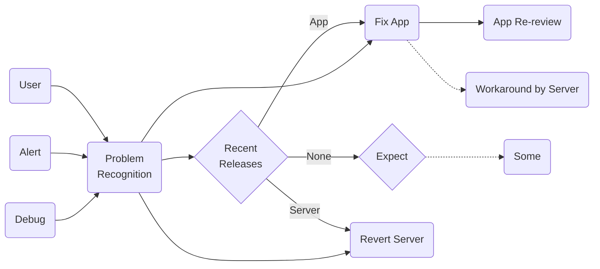
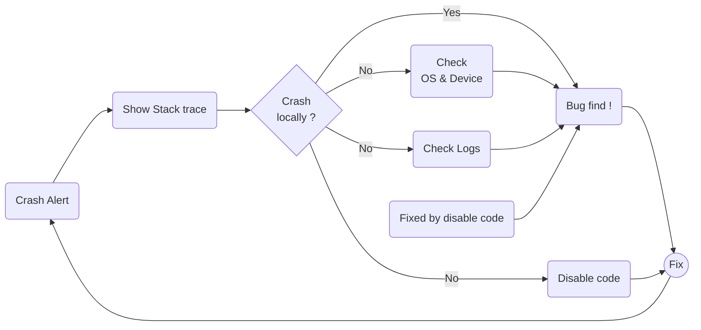
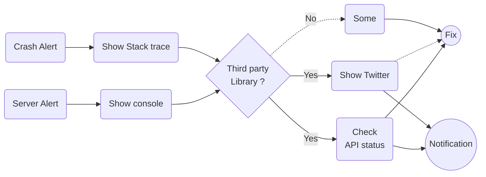

# AkkeyLab 流イミフクラッシュ解読術

## Introduction
- 手元で再現できない
- 心当たりのないクラッシュ
- 何ヶ月も触ってない行でクラッシュ

このように嫌な予感がする現象に皆さん一度は遭遇したことがあるのではないでしょうか。  
そして、調査手順次第ではもっと早く原因特定できたのに…と悔しい思いをしたこともあるかもしれません。  
そこで、本稿では効率的な原因探索方法を図を用いて解説いたします。ぜひ、本稿を元にチームでアレンジを加え、秘伝のタレとして育ててみてはいかがでしょうか？ドメイン知識の薄い新メンバーも爆速で難問解読のプロになること間違いなしです！

本稿は GitHub で管理されており、最新の状態が閲覧できるだけでなく、皆様からのご指摘にも対応可能となっております。ぜひ、ご活用ください。  
GitHub: https://github.com/AkkeyLab/technical-article

## 前提
本稿ではグラフの描画に mermaid を利用して執筆いたしました。そのため、皆さんの開発環境に合わせた改良が施しやすくなっております。  
ちなみに、私が所属するWED株式会社のエンジニアチームでは mermaid を GitHub や Notion 上で積極的に利用しており、業務での利用も増えているツールのように感じています。ですから、mermaid をまだ使ったことがないという方は本稿を参考に導入を検討してみるのも良いかもしれません。

## 1. 問題の認知

これから難問の解読方法をいくつか紹介していくのですが、不具合が発生・発覚した場合の基本的な対処方法の実施が前提になります。ということで、まずは基礎から見ていきましょう。

### 3つのトリガー
我々開発者が問題発生を認知することになるトリガーは大きく3つあります。  
まず、ユーザからのお問い合わせです。ユーザの IT リテラシー度合いによっては、不具合だと勘違いしているだけだったり、「クラッシュ」「閉じる」「フリーズ」などの用語を間違って利用していたりするため、サービス側の不具合だと判断することは決して簡単ではありません。  
最低限、類似のお問い合わせが短期間に複数あった場合は調査を行うというルールを設けておく必要があるでしょう。

次に、アラート通知です。ネイティブアプリでは Firebase Crashlytics が有名です。メール・Slack・電話など緊急度合いに合わせて開発者に通知する仕組みを活用することと、それを受け取ったときの対応方針を事前に決めておくことが重要です。

最後に、開発中に気づくパターンです。たまたまユーザがあまり遭遇しないパターンでの不具合やリリース前の機能に対する不具合を開発中に発見することがあります。どれだけ開発が忙しくてもタスクとして書き出すことを怠ってはいけません。

### 直近の変更を疑う
問題を認知したら優先度を決めて対応方針を決めていきます。原因が明確な場合は直接修正作業に移行できますが、そうでない場合は順に調査をしていく必要があります。  
まずは、問題が発生し始めたと考えられる時間帯周辺でサービスに関連するリリースが行われていたか確認を行います。アプリで段階リリースを行っている場合はさらに考慮する時間の幅が広がることにも注意する必要があります。  
また、そのリリースがサーバサイドで行われていた場合、可能であれば切り戻し作業を実施します。アプリの場合は修正を行って申請（緊急時は特急申請）するという流れになりますが、一定の時間を要するため、サーバ側で応急処置を施すという選択肢も考慮に入れる必要があります。

### 何もしてないのに…
直近リリースを行っておらず、設定の変更なども行っていないという場合は外部要因だったり、時限式で発火するイベントがトリガーとなっていることがあります。ですから、何かが原因で発生したものであるということを前提として調査を進める必要があります。  

## 2. アプリ起因の不具合
アプリ側の実装によって発生するようになったクラッシュであるというところまで原因特定ができている場合を考えてみましょう。  
スタックトレースの確認と手元での再現確認は必須です。問題はこれで原因特定ができなかった場合です。

### クラッシュ直前の規則性
スタックトレースとセットで見ていただきたいのがイベントログやスクリーンログです。これらを用いて、クラッシュ直前のログに規則性がないか複数のログから確認を行います。  
この調査方法が有効なシチュエーションとしては、クラッシュ箇所とは別のところに引き金が潜んでいるケースです。例えば、チュートリアル動画再生部分でメモリリークが発生し、その後の操作でクラッシュしてしまうケースがです。この場合、クラッシュしているユーザは直前にチュートリアル動画を視聴しているという規則性が見られるはずです。

### 変更の一部を戻してみる
「手元で再現しない、ログからも原因がはっきりしない、でもココらへんが原因でクラッシュするようになったのは確かなようだ」このような状態で煮詰まってしまうこともあるでしょう。  
このような場合は思い切って原因と思われる箇所を元に戻してリリースしてみましょう。悔しいですが、調査中にも多くのユーザがクラッシュに遭遇し、最悪の場合それが原因で離脱しているという状況は早急に対処しなければなりません。

ポイントはどれだけ元に戻すかです。  
「直近のリリースでプロフィール画面を触っていて、プロフィール画面内でのクラッシュが発生するようになった」のように、ざっくりとした原因箇所が分かる場合はそこのみを元に戻すという選択肢もあります。これにより、他の変更箇所はクラッシュと無関係となり、調査範囲を狭めて調査を進めることができるようになります（もちろん、100%無関係とは言えませんが）。  
ただし、クラッシュ遭遇率が高いなど緊急度が高い場合はリリース全体の切り戻しを行うことをおすすめします。これは、先程の「ざっくりとした原因箇所」が間違っていた場合というリスクを排除するためです。

### 再現させるための工夫
ここで、不具合を再現する手助けとなるポイントをいくつかご紹介します。ただし、ログ経由で分かる端末の種類や端末の向き、OS バージョンなどは除外しています。  
エンジニアはスマートフォンや通信環境などのクオリティが高い環境にいることが多いため、低スペック環境起因の不具合には遭遇しにくく落とし穴になっていることが多いです。また、日本で利用していても端末の言語や地域の設定は自由に変更できるため、日時・通貨も注意が必要になってきます。

- 通信
  - キャリア
  - Wi-Fi
    - インターネットサービスプロバイダーでの制限
- 低スペック環境
  - 通信速度低
  - サポートしている中で最も古い端末（実機）
  - バッテリー容量が低下時に発生する処理速度低下
- 本体設定
  - ダークモード・ライトモード
  - 言語と地域の組み合わせ
- どのようにアプリを開くか
  - プッシュ通知
  - ウィジェット
  - URL scheme
  - バックグラウンド

## 3. 外部要因の不具合
外部要因によって通信エラーやクラッシュが発生しているというところまで原因特定ができている場合を考えてみましょう。  
通信エラーだと CDN が原因の大規模障害、クラッシュだと特定のバージョンの FacebookSDK を組み込んだアプリが起動不能になる大規模障害などが実際に発生しています。

### ステータス確認
クラッシュや通信エラーのログからサービス内で利用しているサードパーティ製ツールもしくは API が原因と考えられる場合、ステータス確認を行いましょう。ここで原因特定ができ、外部サービスの復旧を待たなければならない場合は、その旨をユーザに通知しましょう。  
また、本稿では触れませんが、サーバサイドで一時的回避作業を行うこともあります。

### Twitter を確認
上記で「ステータスを確認しましょう」と書きましたが、実際少しラグがあります。あなたがバックエンドも担当しているのなら、他のエンジニアが同じ状態に遭遇していないか、原因はどこにありそうなのかなどを事前に仕入れて、できるだけ早く調査を開始することが非常に重要になってきます。  
そんな時に活用できるのが Twitter（SNS）です。皆さんは、GitHub ページにユニコーンが現れたとき（障害発生時）に Twitter を見に行った経験はありませんか？このように、障害発生時にも世界中のエンジニアが SNS 上で情報交換を行っています。

しかし、注意しなければならないこともあります。非公式の情報を真に受けてはいけないことは誰もが意識していると思いますが、他人に伝達する時は非公式情報であることもセットで伝える必要があることに注意しなければなりません。

GitHub Unicorn: https://github.com/503.html

---

最後までお読みいただきありがとうございます。

このように問題発生時の調査・対応手順をドキュメント化しておくことは非常に重要です。  
詳しいメンバーが有給休暇中・体調不良、深夜帯など予期しないタイミングで発生することが多いのが障害です。このような時、メンバーが対応手順を把握しているか否かで対処スピードは大きく変わることでしょう。  
また、mermaid を使えば課題になることの多いドキュメントのメンテナンスコストも低くすることができるかもしれません。

どこか一部でも皆さんの環境に活かせるものがあると嬉しいです。  
本稿は GitHub で管理されておりますので、気軽に issue などの形で質問や修正依頼いただけますと幸いです。
