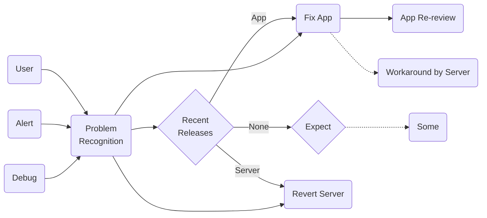

# AkkeyLab 流イミフクラッシュ解読術

## Introduction
- 手元で再現できない
- 心当たりのないクラッシュ
- 何ヶ月も触ってない行でクラッシュ

このように嫌な予感がする現象に皆さん一度は遭遇したことがあるのではないでしょうか。  
そして、調査手順次第ではもっと早く原因特定できたのに…と悔しい思いをしたこともあるかもしれません。  
そこで、本稿では効率的な原因探索方法を図を用いて解説いたします。ぜひ、本稿を元にチームでアレンジを加え、秘伝のタレとして育ててみてはいかがでしょうか？ドメイン知識の薄い新メンバーも爆速で難問解読のプロになること間違いなしです！

本稿は GitHub で管理されており、最新の状態が閲覧できるだけでなく、皆様からのご指摘にも対応可能となっております。ぜひ、ご活用ください。  
GitHub: https://github.com/AkkeyLab/technical-article

## 前提
本稿ではグラフの描画に mermaid を利用して執筆いたしました。そのため、皆さんの開発環境に合わせた改良が施しやすくなっております。  
ちなみに、私が所属するWED株式会社のエンジニアチームでは mermaid を GitHub や Notion 上で積極的に利用しており、業務でも利用されることが増えているツールのように感じます。ですから、mermaid をまだ使ったことがないという方は本稿も参考に導入を検討してみてはいかがでしょうか。

## 1. 問題の認知：

これから難問の解読方法をいくつか紹介していくのですが、不具合が発生・発覚した場合の基本的な対処方法の実施が前提になります。ということで、まずは基礎から見ていきましょう。

### 3つのトリガー
我々開発者が問題が発生していることを認知することになるトリガーは大きく3つあります。  
まず、ユーザからのお問い合わせです。IT リテラシーの度合いによっては、不具合だと勘違いしていたり、「クラッシュ」「閉じる」「フリーズ」などの用語を間違って利用していたりするため、サービス側の不具合だと判断することは決して簡単ではありません。最低限、類似のお問い合わせが短期間に複数あった場合は調査を行うというルールを設けておく必要があるでしょう。

次に、アラート通知です。ネイティブアプリでは Firebase Crashlytics が有名です。メール・Slack・電話など緊急度合いに合わせて開発者に通知する仕組みを活用することと、それを受け取ったときの対応方針を事前に決めておくことが重要です。

最後に、開発中に気づくパターンです。たまたまユーザがあまり遭遇しないパターンでの不具合やリリース前の機能に対する不具合を開発中に発見することがあります。どれだけ開発が忙しくてもタスクとして書き出すことを怠ってはいけません。

### 直近の変更を疑う
問題を認知したら優先度を決めて対応を方針を決めていきます。原因が明確な場合は直接修正作業に移行できますが、そうでない場合は順に調査をしていく必要があります。  
まずは、問題が発生し始めたと考えられるタイミング周辺でリリースが行われていたかの確認を行います。アプリで段階リリースなどを行っている場合はそれも考慮した範囲で確認する必要があります。  
次に、そのリリースがサーバで行われていた場合、可能であれば切り戻し作業を実施します。アプリの場合は修正を行って申請（緊急時は特急申請）するという流れになりますが、一定の時間を要するため、サーバ側で応急処置を施すという選択肢もあります。

### 何もしてないのに…
直近リリースを行っておらず、設定の変更なども行っていないという場合の調査方法は様々です。その調査方法についても以後ご紹介いたします。
