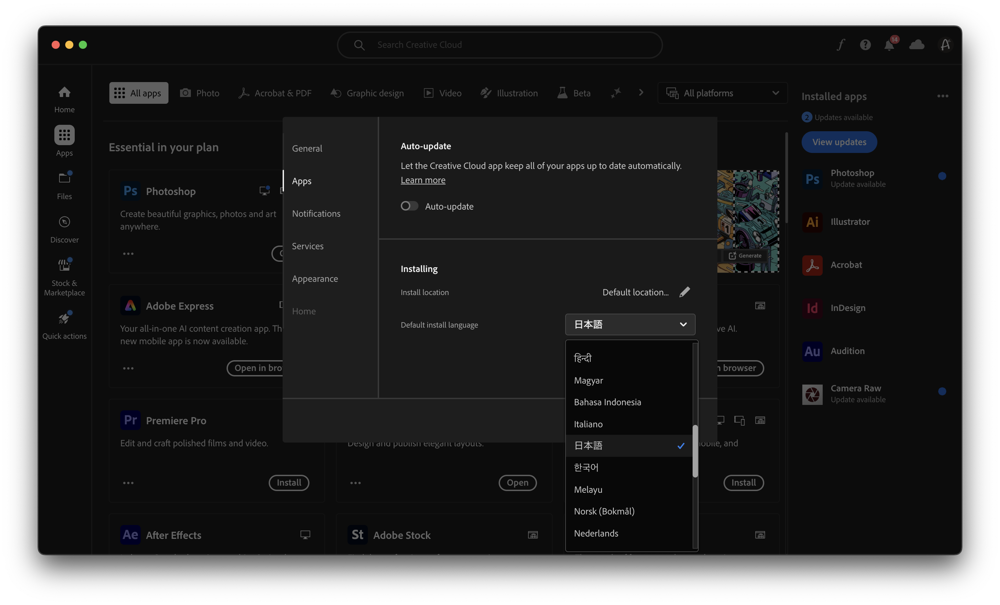
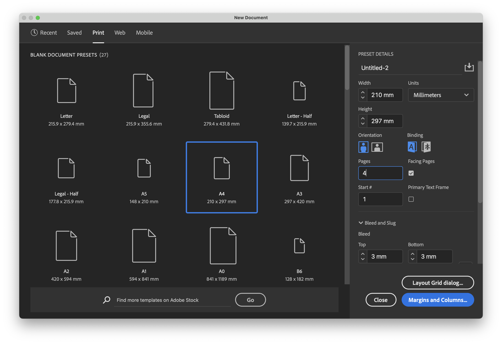
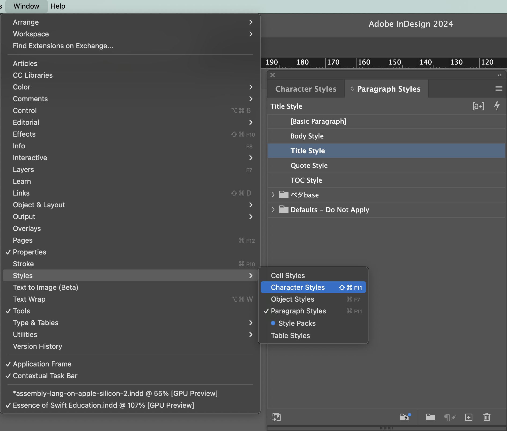
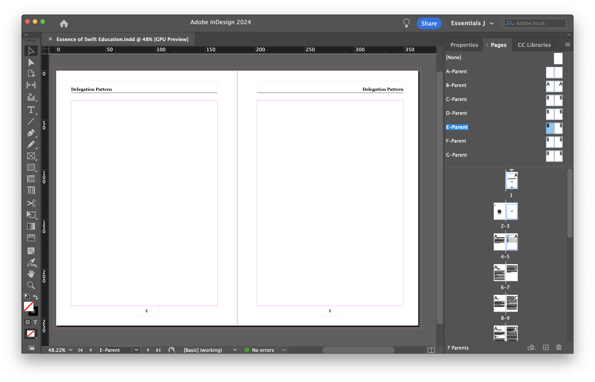
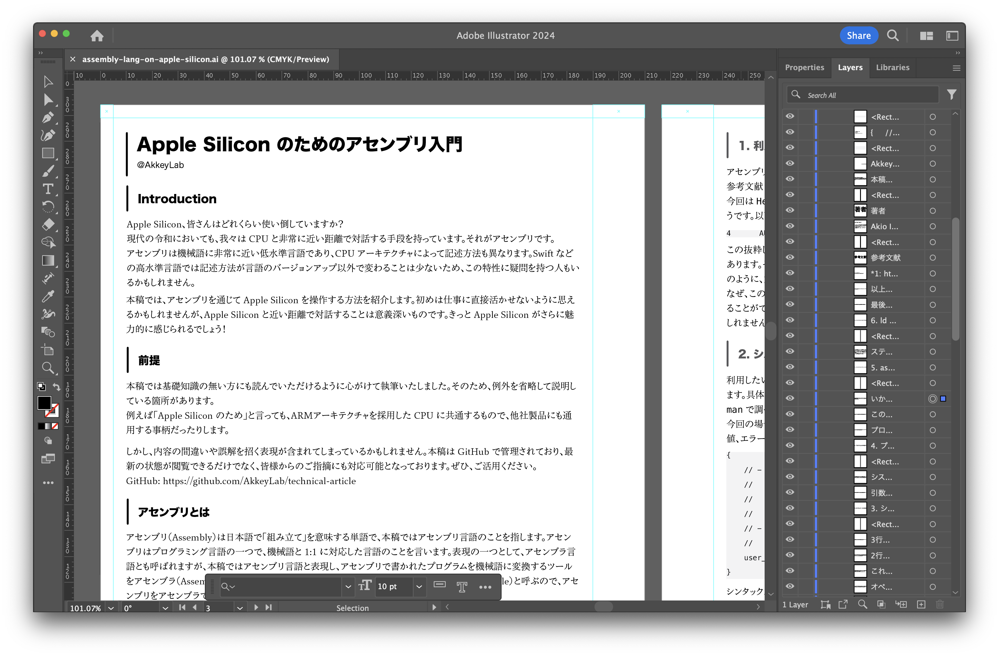
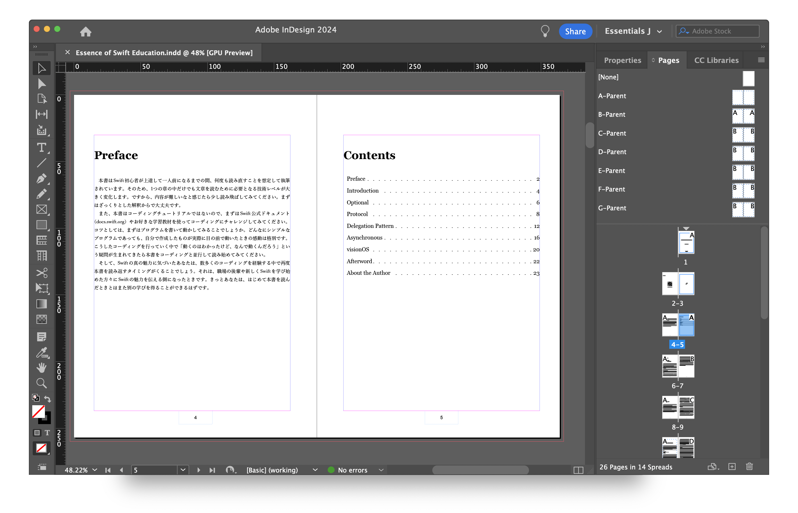

# Adobe InDesign を使った技術書作成の基礎

## Introduction
みなさん、技術書を書いたことはありますか？  
紙の本として印刷する場合、さまざまな決まりにしたがってレイアウトを施す必要があります。たとえば、用紙サイズ・左綴じと右綴じ・余白・断ち切り・背幅・トンボ・ノンブルなどがあります。これらの設定を手助けしてくれるツールは数多く存在しますが、本稿では Adobe InDesign を例に技術書作りのノウハウをご紹介します。  
パンフレットを読んで「私もパンフレット記事を書いてみたい！」と思った方はもちろん、他のツールを使って執筆を行っている方にとっても有益な情報となること間違いありません！

## 前提
- Adobe InDesign 2024
- macOS Sonoma
- macOS Primary Language: English

本稿では上記の環境を前提に執筆しております。macOS の言語設定が日本語であった場合も基本的な操作手順は同じですので、参考にしていただけますと幸いです。なお、これは推奨環境ではないことに注意してください。これからご紹介する内容にも関連しますが、macOS の言語設定を日本語にしておくことでトラブルの発生確率を下げることができます。

## JIS or ISO
技術書を紙の本として印刷することを考慮する場合、まずは用紙サイズを決める必要があります。技術同人誌というジャンルで見るとB5もしくはA5というサイズが多い傾向にあるようです。  
ここでみなさんは、B5というサイズ名が具体性に欠けていることに気づきましたか？厳密にはJISのB5なのかISOのB5なのかを明確にしなければならないのです。まずJISとは Japanese Industrial Standards の略で、主に日本国内におけるさまざまな基準を提供しています。次にISOとは International Organization for Standardization の略で、国際的にさまざまな基準を提供しています。このように、JISは日本国内に特化しているのに対し、ISOは適用範囲が国際的であるという違いがあります。そして、どちらとも製品の品質と安全性を確保し、取引の円滑化や産業の発展に寄与する重要な規格体系となっています。  

- JIS B5 182 × 257 mm
- ISO B5 176 × 250 mm

なぜこの話題を取り上げたのかというと、JISとISOで用紙サイズが異なるためです。具体的には、上記のように JIS B5 が ISO B5 よりも少し大きいのです。現状の Adobe InDesign 上ではJISとISOのどちらが採用されているかが明示されていないため、Adobe Creative Cloud や macOS の言語設定が日本語になっていない場合は特に注意する必要があるのです。

Adobe InDesign は複数言語に対応しており、アプリも別物として扱われます。なので、インストール前に Adobe Creative Cloud で日本語版をインストールするように設定しておく必要があります。設定画面には Default install language と書かれていますが、Region 設定に近い意味合いで準備されている設定項目だと思われます。その証拠に日本語版をインストールしても、macOS の設定言語に合わせて英語表記になることを確認しています。

実際に著者は、印刷所に入稿したあとになってからこれらの事実を知ることとなります。では、このようなミスを未然に防ぐことはできなかったのでしょうか。実は、Adobe InDesign には用紙のサイズ名だけでなく実際のサイズが表示されているため、これを確認することで初期段階で対処することも可能だったのです。  
今回は海外仕様で作成してしまったという失敗談としてご紹介しましたが、意図的に海外仕様で作成したい場合にもこのノウハウを応用することができます。

## Paragraph Styles

Adobe InDesign がもつ便利機能のひとつである「段落スタイル」についてご紹介します。これは、フォント・サイズ・余白などテキストに関連するさまざまなスタイルを定義して使い回すための機能です。  
ここで紹介しているスクリーンショットは、実際に私が技術書を執筆した際に作成した段落スタイル一覧になります。ここでは、タイトル・本文・引用・目次を準備しており、技術書執筆においては必須な要素といえるでしょう。では、このような設定はゼロから作らなければならないのでしょうか。実はそんなことはなく、テンプレートからコピーすることが可能でなのです。この段落スタイルは、それが適応されて文字をコピー＆ペーストするだけで段落スタイルもペースト先にコピーすることができます。

## Parent Page

最後に、Adobe InDesign がもつ便利機能のひとつである「親ページ」をご紹介します。旧バージョンでは「マスターページ」と呼ばれていたもので、奴隷制度を連想させる用語の排除によって機能名が変更されています。  
親ページは、ドキュメント内の複数のページに共通のレイアウト要素を一度に設定できる機能です。親ページを使用すると、ヘッダーやフッター、ノンブル（ページ番号）、ロゴなどの繰り返し使用されるデザイン要素を一括で管理でき、各ページに反映させることができます。また、親ページは複数作成することができるため、章ごとに異なるヘッダーを用意する場合にも便利です。

実は、著者は今まで Adobe Illustrator を使って書籍のレイアウト作成を行っていました。ガイドの設定から始まり、文字はタイトル・本文・ソースコード・引用などスタイルに合わせてテキストラベルを作成し、全てコピー＆ペーストでスタイルの統一化を図っていました。多少面倒な作業が多いですが、この方法でも目的の達成は可能です。しかし、この方法の決定的な欠点は「メンテナンス性の低さ」と「修正の困難さ」です。無造作に量産されたテキストラベルによってレイヤーパネルは本来の利便性を一切活用できない状態となっており、一度すべてのレイアウトを組み終えた後での修正は困難を極めます。なぜなら、テキストラベル間の距離や配置は全て手動で行われているため、修正箇所以降全てのレイアウトを再調整する羽目になるのです。

そんな過去の経験を活かし、iOSDC Japan 2024 の原稿からはすべて Adobe InDesign を使ってデザインしております。技術書の同人誌を作るツールとしてはオーバースペックかもしれませんが、商業誌またはそれに匹敵するクオリティを実現できるツールに慣れておくことには大きな意味があると考えています。最終的にどのツールを愛用するかは人それぞれかと思いますが、本稿を読んで少しでも興味を持っていただけましたら、ぜひ Adobe InDesign も触ってみてください！

## Essence of Swift Education
こちらの技術書が ISO B5 サイズで作成・入稿してしまった思い出の一冊になります。締切超過にも関わらず、印刷所さんのご厚意で修正対応のお時間をいただき、無事に人生初の技術書が完成しました。  
この技術書は、ちょっと変わった Swift の入門書となっており、アニメやゲームを題材に、言語機能の本質的な仕組みや考え方を解説いています。また、まだこれから学ぶという方も多いであろう visionOS に関する解説も収録しています。

---

iOSDC Japan 2021 から4年連続で技術記事をパンフレットに掲載していただきました。プロポーザルの採択判断をしてくださっている方々や運営のみなさん、そして技術記事を読んでくださっているみなさん、本当にありがとうございます。

## 著者
Akio Itaya （akkey）

- AkkeyLab株式会社 代表取締役
- 株式会社AppBrew エンジニア
- 合同会社アイネット エンジニア

AkkeyLab は 板谷 晃良 の商標又は登録商標です
