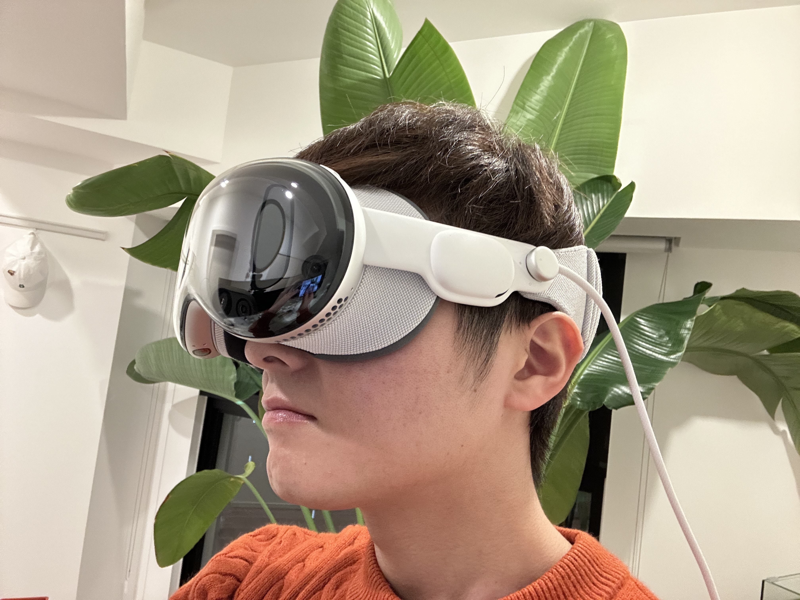

# Apple Vision Pro 実機活用術

## Introduction
Apple Vision Pro が遂に日本に上陸したということで、実機活用術をご紹介します！  
著者はコーディングやミーティングでフル活用しており、オフィスで Apple Vision Pro を装着して歩き回っても、慣れて誰も反応しなくなる程度には高頻度で活用しています。また、体験会などを通じて100人以上の方に実機を提供してきた実績を持ちます。  
Apple Vision Pro は Apple 製品の中でも高価格帯に位置づけられるため、「数ヶ月で使わなくなったらどうしよう…」なんて不安を覚える方も少なくないでしょう。しかし、本稿を読めばそんな心配を払拭することができるかもしれません。空間コンピュータは新しいジャンルなので、想像だけでクリエイティブなアイデアを生み出すのにも限界があります。ぜひ、実機を活用するなかで素晴らしいアプリケーションを創り出してください！

## Apple Vision Pro
iPhone や Mac で知られる Apple から空間コンピュータという新しいジャンルの製品が発表されました。その名を Apple Vision Pro と言い、一般的に複合現実ヘッドセットと呼ばれる製品です。  
これには専用の OS である visionOS が搭載されていますが、アプリ開発者が拒否した場合を除いて iOS, iPadOS 向けのアプリも利用可能です。さらに、Mac との連携機能も標準搭載されています。  
Apple Vision Pro は2024年2月2日に米国で販売が開始され、日本には2024年6月28日に上陸しました。

## 娯楽領域での活用術
### Disney+（ディズニープラス）
- Apple Vision Pro がもつ強みを最大限に活かしている
    - 片目4Kに匹敵する画質
    - 空間オーディオ
    - 無段階調整可能なイマーシブ空間
- 継続的に楽しむことができる
    - ディズニー作品以外も配信されている

WWDC23 で Apple Vision Pro の情報が解禁となった際に紹介されたアプリのひとつである Disney+ を私はお勧めします。きれいな画面で映像コンテンツが見れるだけでしょ？と思った方、まさしくそのとおりです。しかし、実際に利用しなければ分からない感動的な体験がそこにはあるのです。  
まず、片目だけで4Kに匹敵するピクセル数をもつディスプレイはとてもきれいです。さらに、視聴環境を選ばないという強みを持ちます。たとえば、朝日が差し込む部屋でテレビを見ることを考えてみてください。きっとカーテンを閉めたいと思うはずです。しかし、Apple Vision Pro で見える映像はすべて本体に搭載されたカメラを経由して処理されているため、環境光がコンテンツを邪魔することはありません。極端な話、晴天のビーチでも快適に映像作品を楽しむことができるでしょう。  
次に、空間オーディオに対応した本体内蔵スピーカーです。もちろん AirPods Pro を接続することでさらに高品質で音漏れを抑えた環境が手に入るわけですが、内蔵スピーカーでも十分満足できると感じさせてくれる実力があります。プランによりますが、Disney+ は高音質のコンテンツ配信に対応しているため、空間オーディオの恩恵を最大限得ることができるでしょう。  
最後に、イマーシブ体験の素晴らしさをご紹介します。Disney+ からは複数の映像視聴環境が提供されており、まるで映画館にいるような環境で映像コンテンツを楽しむことができます。なんだ、それだけのことかと思った方もいるかも知れませんが、これが非常に素晴らしいのです。また、Apple Vision Pro ではイマーシブ空間を無段階で調整することが可能になっており、「映画を見ている時は邪魔されたくない」「軽く作業をしながらアニメを見るのが日課」といったニーズに柔軟対応することが可能なのです。

## 業務領域での活用術
### Mac Virtual Display
- ベッドで仕事も夢じゃない
- ショルダーハックの防止
- 良い姿勢を維持しやすい

もしあなたが日頃の業務で Mac を活用しているのであれば、この機能でさらなる業務の効率化を実現できるかもしれません。Mac Virtual Display はその名のとおり、Mac の画面を Apple Vision Pro 上に投影する機能で、visionOS に標準で搭載されています。  
まず、macOS との接続はワイヤレスで行われるため、Mac から少し離れての作業も可能です。つまり、ワイヤレスキーボードとトラックパッドを準備することで、Mac はデスクに置いたままの状態でベッドの上からの仕事が可能になってしまうのです。ここで「ミーティングのときにサボっていると思われるのでは…」と思った方もいるかも知れません。ご安心ください！Persona を使うことで完璧な姿でミーティングに出席することが可能なのです。Persona は Apple Vision Pro に標準搭載されている機能のひとつで、自身の顔をスキャンすることによって作成された 3D データを利用したアバターです。  
次に、セキュリティ面でも非常に優秀であることをご紹介します。Mac Virtual Display を利用している時は Mac の液晶が消灯するため、画面を見ることができるのは Apple Vision Pro を装着しているあなただけになるのです。つまり、画面を後ろから覗いて情報を盗み取るショルダーハックを防止することができます。これによって、カフェで作業を行う場合でも周りを気にすることなく作業に集中することが可能になります。  
最後に、仕事中の姿勢改善にもつながることをご紹介します。Mac Virtual Display で表示される映像は空間上の好きな場所に配置することができ、サイズも自由に調整可能です。ですから、MacBook の画面を覗き込むことによって猫背になってしまうことを防止できるのです。もちろん、外部ディスプレイを置いたり、スタンドを利用することでこの問題を解決している方も多いかと思いますが、外出先などどんな場所でも同様の環境が手に入るのは Apple Vision Pro だけです。

### Persona Anywhere
- Mac でも Persona を利用可能
- Mac 上では Persona を仮想カメラとして認識
- 著者が作りました

Persona は visionOS 上で実行されたアプリケーション経由でしか基本的に利用することができません。ですから、Apple Vision Pro と Mac を連携させて、Mac 経由でミーティングアプリを起動すると、Persona が利用できず、Apple Vision Pro を装着した姿が映し出されてしまうのです。この問題を解決するために開発されたのが、visionOS 専用アプリ Persona Anywhere と macOS 専用アプリ Persona Viewer です。  
Persona Anywhere はシンプルな設計となっており、誰でも簡単に利用可能な製品を目指して開発されています。このアプリが Apple Vision Pro の Persona を Mac に転送する役割を果たします。Persona Viewer は Apple Vision Pro から受信した Persona データを Mac 上で仮想カメラとして認識できるように処理を施します。仮想カメラであるという点がポイントで、オンラインミーティングや収録、映像配信など、カメラを Mac に接続して利用するソフトウェアでは、通常のカメラと同様の操作方法で Persona をご利用いただくことが可能です。

## 疲れにくい装着方法
Apple Vision Pro はバッテリーを内蔵していないにもかかわらず比較的重いことが販売開始当初から問題視されています。しかし、本当に重さだけで装着感が決まってしまうのでしょうか。私は決してそんなことはないと考えており、パーソナライズされたライトシーリングとクッション、バンドが重さによる疲れを軽減させてくれているように感じています。ですから、購入時のフェイストラッキングで選定されたパーツが実際にはフィットしていないように感じる場合は、パーツのサイズ変更を検討してみるとよいでしょう。ただ、どんなにフィットするパーツだったとしてもさまざまな要因で快適に装着できないことがあります。次にその一例と改善案を紹介します。

- 寝不足などの体調不良
- 不安定なメンタル
- 不安定な装着
- パーツを清潔に保つ

まず、体調不良は体験の質を大きく低下させます。また、これに近い要因としてメンタル面が挙げられます。たとえば、業務で取り組んでいる課題が非常に難解でメンタル的に少し疲れが出ている状態なども体験の質を大きく低下させます。私は実際に Apple Vision Pro の重さや圧迫感が通常時以上に気になってしまうことがありました。おそらく、集中力が低下し、ちょっとした違和感に対しても敏感になってしまったのだと思います。解決策ですが、回復するまで使用を控えるか、長時間の使用を控えることをお勧めします。これが原因で使わなくなってしまうのは非常にもったいないです！  
次に、装着方法についてです。Apple Vision Pro は13歳以上であれば人種に関係なくパーソナライズできるように設計されています。しかし、カチッと頭にはまるものではないので多少の装着感は自身で調整する必要があります。この調整も人によって最適な方法が異なるので「これ」という解決策を提示できないのがはがゆいですが、数週間くらい定期的に装着してみて最適な装着感を探してみてください！ポイントとしては、「どれくらい長時間装着できたか」を比較することでしょうか。装着感が悪いと10分経っただけでも目の周りらへんから小さな痛みを感じるようになります。

最後に、私が日頃どのように装着しているのかご紹介します。本体部分を軽く顔に当てながらソロニットバンドを頭の後ろに持っていくとき、バンドがあまり下になりすぎないようにしましょう。私の場合は、ソロニットバンド部分が耳に当たらないギリギリになるようにするとバランスが取れました。横から見ると水平に近い形で装着できていることが分かるかと思います。  
Apple Vision Pro にはデュアルループバンドという頭の上からも支えることのできるバンドが付属していますが、私はこのソロニットバンドでほぼ毎日過ごしています。ぜひ、快適な装着感を探してみてください！

## visionOS デベロッパへの第一歩
...

---

最後までお読みいただきありがとうございます。  
...ですが、今年の iOSDC はオフライン開催が予定されておりますので、ぜひ私を探して質問攻めしちゃってください。  

## 著者
Akio Itaya （akkey）

- AkkeyLab株式会社 代表取締役
- 株式会社AppBrew エンジニア
- 合同会社アイネット エンジニア

AkkeyLab は 板谷 晃良 の商標又は登録商標です
