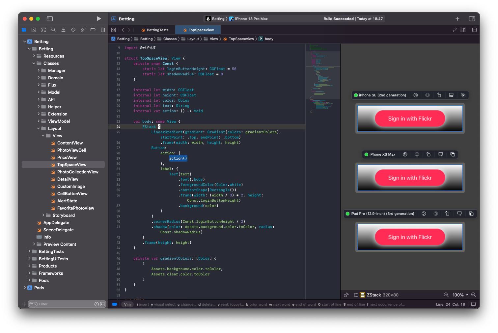

# API 繋ぎこみトラブル撲滅委員会

## Introduction
API 繋ぎこみを後回しにした経験、皆さんありますでしょうか。  
もしあるのであれば、開発終盤で API の仕様変更が必要なことに気づいたり、API 仕様とシンクしない UI を構築してしまったり、バックエンド側の開発速度に強く依存してしまうという経験をお持ちかもしれません。特に最後のものに関しては「仕方ないよね」と根本的解決を置き去りにされてしまう可能性が高いように思います。

本稿では、私が本業と複数の副業で実践済みのテクニックをご紹介します！  
実例と共に初心者〜中級者向けに執筆いたしました。大規模なリファクタリング不要で、読んでいただいた直後から実践・成果を実感していただけるはずです！

本稿は GitHub で管理されており、最新の状態が閲覧できるだけでなく、皆様からのご指摘にも対応可能となっております。ぜひ、ご活用ください。  
GitHub: https://github.com/AkkeyLab/technical-article

## アプリ開発者目線で見る OpenAPI
まず、OpenAPI が一体何者なのかから見ていくことにしましょう。もしかしたら、Swagger と言うと聞いたことがあるという方も多いかもしれません。

> The OpenAPI Specification (OAS) defines a standard, language-agnostic interface to RESTful APIs which allows both humans and computers to discover and understand the capabilities of the service without access to source code, documentation, or through network traffic inspection. When properly defined, a consumer can understand and interact with the remote service with a minimal amount of implementation logic.

引用： https://swagger.io/specification/

OpenAPI Specification には上記のように説明が書かれており、アプリエンジニア目線で見ると、API 仕様書フォーマットの1つであるといえます。つまり、この仕様書がバックエンドとフロントエンドで共通のインターフェースとなるのです。

累計数百万枚ものレシート買取実績を持つ ONE の開発チームには、仕様を確定させた後に以下のような手順で開発を進める文化があります。なお、説明の都合上、以後アプリエンジニアをフロントエンドエンジニアと表現することとします。

1. バックエンドもしくはフロントエンドエンジニアが OpenAPI 定義を更新
2. 施策に関わるバックエンドとフロントエンド両者の承認を得たプルリクがマージされる
3. バックエンド、フロントエンドでそれぞれ開発を開始

ポイントは、バックエンドとフロントエンドの両者が OpenAPI メンテナンスに関わるという点です。これによって OpenAPI が両者における共通言語となっているのです。つまり、バックエンド・フロントエンドがどんな言語・設計で構築されているかに関係なく両者が API 仕様の議論に集中できるのです。  
このように API 仕様をメンテナンスしていくことで、API 仕様の把握不足に起因する失敗の可能性を低減させることができます。しかし、仕様が決まったとしても、実際に API をコールすることができるのはバックエンドの開発がある程度進んでからになる事実は変わりません。このようなタイミングでも快適にアプリ開発を進めるテクニックを次に紹介していくことにします。

## Moya 利用時の Stub 活用術
ネットワーク抽象化レイヤを担う Moya を皆さんはご存知でしょうか。  
Alamofire, RxSwift などと依存関係を持つため賛否はあるものの、個人的にも愛用しているサードパーティ製 framework です。初耳な方はこれを機に使ってみてはいかがでしょうか。また、ネットワーク周りの実装が異なる場合は、ソリューションの一つとして参考にしていただければと思います。

### 前提
次に、Stub（スタブ）を皆さんはご存知でしょうか。  
プログラミングの分野では「実際の動作結果の代わりに準備された代用品」という意味で使われる用語になります。例えば、iOS アプリの単体テスト内で実際にサーバと通信を行った場合、オフライン環境やサーバメンテ中の環境ではテストが不合格となってしまいます。そこで、期待する通信結果を Stub という形で準備することで、通信環境やバックエンドの状態に依存することなく iOS アプリ自体に対するテストに集中できるのです。  
Stub は知っていた！という皆さんは Stub と Mock の違いについて考えてみると面白いかもしれません。ぜひ iOSDC 会場での会話ネタにしてみてください！  

### Stub の利用
では、Moya でその Stub を利用する手順を見ていきましょう。  
API コールに必要な情報を Moya では TargetType というプロトコルに準拠させる形で定義して利用します。以下に TargetType の定義を示します（本稿執筆時点の Moya リポジトリを参考にしました）。

```swift
import Foundation

public protocol TargetType {
    var baseURL: URL { get }
    var path: String { get }
    var method: Moya.Method { get }
    var sampleData: Data { get } // <-- This
    var task: Task { get }
    var validationType: ValidationType { get }
    var headers: [String: String]? { get }
}
```
引用： https://github.com/Moya/Moya/blob/master/Sources/Moya/TargetType.swift

上記定義の中で、Data 型を返す sampleData が今回利用するものになります。ここに期待するレスポンスを指定することで、Stub 機能を利用した通信処理の実行が可能になります。具体的な実装方法を以下に示します。

```swift
var sampleData: Data {
    """
    [
        {
            "id": "fcf81b2a-36d2-d695-d4b2-akkey2022lab",
            "name": "iOSDC Japan 2022"
        }
    ]
    """.data(using: .utf8)!
}
```

Moya では以下のように Stub を利用するように指定することで、実際に通信を行わず、先程定義した sampleData を結果として返してくれるようになります。汎用的な実装方法に関しては、Moya プロジェクトの単体テストを参考にしてみると良いでしょう。

```swift
struct SampleTarget: TargetType { ... }

MoyaProvider<SampleTarget>(stubClosure: MoyaProvider.immediatelyStub)
    .request(
        SampleTarget(),
        completion: { result in
            // do something
        }
    )
```

### 応用
ここまで Stub とそれを Moya で利用するための方法を紹介してきました。これらは単体テスト内で利用されることが多いですが、バックエンド開発が終わっていないタイミングの開発でも活用することが出来ます。  

```swift
#if DEBUG
    MoyaProvider<SampleTarget>(stubClosure: MoyaProvider.immediatelyStub)
#else
    MoyaProvider<SampleTarget>()
#endif
    .request(
        SampleTarget(),
        completion: { result in
            // do something
        }
    )
```

上記のように分岐処理を施すことで開発版のアプリでは実際の通信を行わず、仮データを表示することが出来ます。これによって、我々が開発しやすくなるだけでなく、チームでのデザインレビューをバックエンド開発を待たずして実施することが可能になります。  
その他にも以下のような利点があると感じています。

- Stub 利用時もパース処理など我々が実装するコードの殆どが実行される
- コンテンツ数によって挙動が変わる実装の動作確認も容易になる
- フレームワークとして切り出せば単体テストにも流用可能

このように Stub を利用することで、バックエンドの開発に依存することなく通信周りの実装が可能なことを紹介しました。しかし、結果を表示する UI の実装に時間がかかってしまえば、動作確認する頃には優秀なバックエンドエンジニアが実装を終えていることでしょう。それでも無駄ではないですが、利点を最大限活かしているとは言い難いのが現状です。  
そこで、UI の実装時間を短縮する方法を考えてみましょう。

## XcodePreviews 活用術
SwiftUI とセットでリリースされた機能である XcodePreviews もかなり認知度が高まってきた頃かと思います。私は副業を中心に SwiftUI 利用の有無に関係なく XcodePreviews を活用し続けています。

### 前提
エックスコードプレビュー？ナニソレオイシイノって方向けに要点をまとめると以下のようになります。

- コードで記述したレイアウトをリアルタイムに表示してくれる
- Storyboard や xib で有名な Interface Builder（IB）のように視覚的にアプリ画面を設計するための補助ツール

IB は NEXTSTEP 時代から存在するソフトウェアが元になっており、当初は独立したソフトウェアとして開発されていました。そして、Xcode 4.0 に統合されて現代まで利用されてきたという過去を持っています。  
そんな IB に変わる存在として XcodePreviews が登場したのです。こんな歴史的瞬間だからこそ、先駆者として XcodePreviews を使い倒してみませんか？

きっと、XcodePreviews が気になりすぎて夜も眠れない状態になってしまった読者の方もいることでしょう。安心してください、どのような原理で動作しているのか GitHub Gist 上で執筆しておりますので、是非ご覧ください。  
GitHub Gist: https://gist.github.com/AkkeyLab/67af9a91498c6c5ad138123cb8ae5c28

### 課題
iOS アプリ開発では、複数の要素で成り立つ画面において「コンポーネント単位での動作確認が難しい」という状況に遭遇しやすいと感じています。その証拠に、デバッグメニューにコンポーネントや画面単体を表示する導線を設けている開発環境も多いかと思います。  
しかし、できることならデバッグメニューより本来の機能開発に注力したいものです。また、だからといって画面の要素を全て作りきってから動作確認していては、根本的問題の発見が遅れたり、作りきるまで誰からもフィードバックを得られないというリスキーな状態が生まれてしまいます。  
そこで、XcodePreviews を使えばコンポーネント単位での動作確認が低コストで実現できるようになるのです。

### 実例


XcodePreviews の利用イメージを上記に示します。このようにコンポーネント単位で実行可能で、各デバイス毎のシミュレート結果が開発画面右側もしくは下側に表示されます。  
ここで表示されるものは従来の IB とは違い、実際にレイアウトに関する一部のコードが実行され、レンダリングされたものになります。ですから、これをデザイナーさんにレビューしてもらい、微調整を行うというフローが実現可能なのです。さらに、SwiftUI で設計すればデザイナーさんに直接微調整を依頼するということもしやすいかもしれません。

また、ログイン中の場合・ログアウト中の場合など、複数のパターンを同時にプレビューさせることができるなど、UI の実装時間を短縮するための活用方法が複数存在します。XcodePreviews の使用感を知りたいという方は、以下を触ってみると良いかもしれません。  
GitHub: https://github.com/AkkeyLab/LazyGrid

---

最後までお読みいただきありがとうございます。

まずは OpenAPI でフロントエンド・バックエンドで仕様の基礎を固めます。その後、通信周りは Stub を活用して実装を進め、UI 周りは XcodePreviews を利用して適宜デザインの微調整を行っていきます。こうすることで、Stub 機能を無効にすれば API 繋ぎこみが完了し、UI も殆どレビュー済みという状態で最終確認もしくは QA さんレビューに進めるのです。  

どこか一箇所でも皆さんの環境に活かせるものがあると嬉しいです。  
本稿は GitHub で管理されておりますので、気軽に issue などの形で質問や修正依頼いただけますと幸いです。
