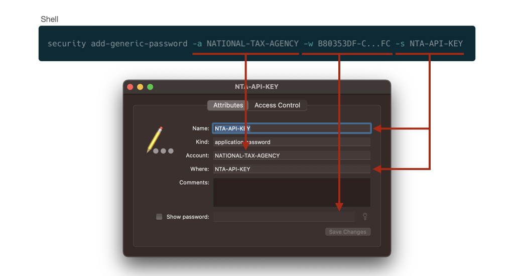

# シークレットキー管理と安全な開発手法

## Introduction
皆さんはシークレットキーをどのように管理していますか？
GitHub Sponsors を利用することで、一定の第三者にコードを公開する手法が登場するなど、ソースコードの公開スタイルは様々です。ただし、機密情報の管理方法には注意が必要です。契約を結んでいない技術者に機密情報が見える状態は、漏洩や不正アクセスなどのトラブルを引き起こす可能性を高めます。
本稿では、既存のチーム開発スタイルを維持しつつ、機密情報を Git のコミットに含めない開発手法を紹介します。Xcode Cloud への対応はもちろん、KMM（Kotlin Multiplatform Mobile）などの異なる開発スタイルでも有効な方法です。これは特に OSS活動 で力を発揮しますが、業務委託契約など、多様な働き方が進む中でトラブルを未然に防ぐためのノウハウとして活用できます。

## 前提
本稿では事例の一つとしてとある API Key を取り扱います。しかし、場合によっては本稿で紹介する方法が最善策ではない可能性がありますのでご注意ください。  
例えば、API Key がコード上になかったとしても配布したアプリの通信を解析したり、アプリを逆コンパイルしたりすることで API Key を取得することが可能な場合があるからです。この場合、バックエンド側の実装に隠蔽することが最善策と言えるでしょう。

本稿は GitHub で管理されており、最新の状態が閲覧できるだけでなく、皆様からのご指摘にも対応可能となっております。ぜひ、ご活用ください。  
GitHub: https://github.com/AkkeyLab/technical-article

## 方針
1. info.plist に定義のみ追加
2. Keychain Access にシークレットキーを追加
3. ビルドのタイミングで info.plist に書き込み

まずは、KMM などを活用しないバニラ環境下におけるソリューションをご紹介します。手順は上記3ステップとなります。

### 1. info.plist に定義のみ追加

```xml
<plist version="1.0">
<dict>
	<key>LSEnvironment</key>
	<dict>
		<key>NATIONAL_TAX_AGENCY_API_KEY</key>
		<string>$(NTA_API_KEY)</string>
	</dict>
</dict>
</plist>
```

info.plist ファイルにシークレットキーの定義を環境変数として追加します。この時、value は後ほど正しい値に置換されるので、適当な値もしくは空にしておきます。  
なお、今回は国税庁公式 API を使ったシステムを例にご紹介しますので、実践される場合は key や value の値を適宜書き換えてください。

### 2. Keychain Access にシークレットキーを追加


GUI もしくは `security` コマンド経由で、ローカルマシンの Keychain Access App にシークレットキーを保存します。チーム開発環境下では、1password などのパスワード管理ソフトにシークレットキーと共に登録コマンドをメモしておくと便利かもしれません。  
なお、 `security` コマンドについては `man security` で調べることができます。

ただし、この操作を CI などで実施しないでください（Xcode Cloud では `security` コマンドの使用が禁じられています）。なぜなら、実行コマンドをセキュアに管理することができないからです。

### 3. ビルドのタイミングで info.plist に書き込み
初めに仮定義を行った `info.plist` ファイルに正しいシークレットキーを書き込むのですが、直接書き込んでしまうと `info.plist` に差分が生じてしまいます。そこで、ビルド時に一時ファイルとして生成される　`Preprocessed-Info.plist` ファイルに書き込むという手法を採用することにしましょう。  
この一時ファイルの生成はデフォルトで無効化されているため、Build Settings から Preprocess Info.plist File の項目を YES に書き換えて有効化します。

```xml
F4C37D3F296AEE2200D0084B /* Debug */ = {
	isa = XCBuildConfiguration;
	buildSettings = {]
		INFOPLIST_PREPROCESS = YES;
	};
	name = Debug;
};
```

`project.pbxproj` ファイルでは上記のように設定が反映されていることを確認してください。なお、Build Configuration の内容と個数はプロジェクトによって異なる可能性がありますので、シークレットキーを利用するもの全てに適応させてください。

次に重要になるのが　`Preprocessed-Info.plist` ファイルを書き換えるタイミングです。このファイルはあくまでも一時ファイルなので、利用される直前がベストであると言えます。したがって、plist ファイルを書き換えるスクリプトは Copy Bundle Resources の直前にすると良いと分かります。  
実際にスクリプトを設定したときの `project.pbxproj` ファイルの一部を以下に示します。

```xml
/* Begin PBXNativeTarget section */
		F4C37D2F296AEE2100D0084B /* c-search */ = {
			...
			buildPhases = (
				F4C37D2C296AEE2100D0084B /* Sources */,
				F4C37D2D296AEE2100D0084B /* Frameworks */,
				F4FDC7E729979DDB0057D80A /* Setting Environment Variables */,
				F4C37D2E296AEE2100D0084B /* Copy Bundle Resources */,
				F4FDC7FB2998D9A10057D80A /* Embed App Clips */,
				F46CEF4E29BD9D610096B6E1 /* Embed Foundation Extensions */,
			);
			...
		};
/* End PBXNativeTarget section */
```

これは、Build Phases の設定が記述されている箇所で、Copy Bundle Resources の直前に Setting Environment Variables という名前でスクリプトを配置していることが分かります。

```xml
/* Begin PBXShellScriptBuildPhase section */
		F4FDC7E729979DDB0057D80A /* Setting Environment Variables */ = {
			...
			inputPaths = (
				"$(TEMP_DIR)/Preprocessed-Info.plist",
			);
			...
			shellPath = /bin/sh;
			shellScript = "...";
		};
/* End PBXShellScriptBuildPhase section */
```

これは、先程 Setting Environment Variables という名前で登録されていたスクリプトの詳細設定が記述されている箇所になります。注意しなければならないこととして、 `Preprocessed-Info.plist` のパスを Input Paths に追加する必要がある点があります。  
ここまでで、plist を書き換える下準備が整ったので、次から実際のスクリプトを書いていくことにしましょう。

```sh
security find-generic-password \
    -a NATIONAL-TAX-AGENCY \
    -s NTA-API-KEY \
    -w
```

まず初めに、Keychain Access に保存されたシークレットキーを取得する方法を確認しておきましょう。実は非常にシンプルで、保存時と同じ `security` コマンドで取得が可能です。

```sh
/usr/libexec/PlistBuddy -c \
    "Set:LSEnvironment:NATIONAL_TAX_AGENCY_API_KEY ${NTA_API_KEY}" \
    "${TEMP_DIR}/Preprocessed-Info.plist"
```

次に、plist ファイルの編集には `PlistBuddy` コマンドを利用します。このコマンドは Xcode Cloud でも利用することが可能です。  
`-c` オプションの次に指定する1つ目の文字列で編集内容を指定します。今回は値の書き込みなので `Set:` で始まり、書き込み対象は plist の key タグを辿って指定します。そして、半角スペースの後に書き込む値を埋め込みます。最後に、2つ目の文字列で書き込み対象のファイルパスを指定しています。

```swift
guard let environment = Bundle.main.object(forInfoDictionaryKey: "LSEnvironment") as? [String: String],
      let apiKey = environment["NATIONAL_TAX_AGENCY_API_KEY"],
      !apiKey.isEmpty
else {
    throw  SearchCompanyError.apiKeyNotFound
}
```

最後に、plist からシークレットキーを取得する処理を実装して動作確認を行ってみましょう。完全なスクリプトは Xcode Cloud 対応のセクションに載せていますので、実践される際はご利用ください。

## Xcode Cloud 対応
Xcode Cloud では `security` コマンドを利用することができません。仮に利用できたとしても、シークレットキーを保存する処理が別で必要になってしまし、セキュアに管理することが難しくなってしまいます。  
そこで、Xcode Cloud のワークフローで設定可能な環境変数を活用してみることにしましょう。

```sh
if [ ! "${NTA_API_KEY}" ];then
    export NTA_API_KEY="$(security find-generic-password -a NATIONAL-TAX-AGENCY -s NTA-API-KEY -w)"
fi
```

このようにスクリプトを改良することで、ローカルマシン上では Keychain Access 経由、Xcode Cloud 上では環境変数経由でシークレットキーを取得することが可能となります。ここでは、Xcode Cloud を例に説明していますが、他の CI サービスでも同様の環境変数を用いてシークレットキーの管理が可能です。  
最終的なスクリプトは以下のようになります。

```sh
if [ ! "${NTA_API_KEY}" ];then
    export NTA_API_KEY="$(security find-generic-password -a NATIONAL-TAX-AGENCY -s NTA-API-KEY -w)"
fi
if [ ! "${NTA_API_KEY}" ];then
    echo "error: NTA_API_KEY does not exist in Keychain Access"
fi
/usr/libexec/PlistBuddy -c \
    "Set:LSEnvironment:NATIONAL_TAX_AGENCY_API_KEY ${NTA_API_KEY}" \
    "${TEMP_DIR}/Preprocessed-Info.plist"
```

---

最後までお読みいただきありがとうございます。

どこか一部でも皆さんの環境に活かせるものがあると嬉しいです。  
本稿は GitHub で管理されておりますので、気軽に issue などの形で質問や修正依頼いただけますと幸いです。

## 著者
- AkkeyLab株式会社 代表取締役
- 株式会社AppBrew エンジニア
- 合同会社アイネット エンジニア

本稿執筆時点で3社に所属するプログラマー兼経営者。  
Swift との出会いは大学。まだ公式ドキュメント以外の情報が少なかったこともあり、Objective-C で書かれたコードを頑張って読んでいたのが良い思い出。今でも Swift を書いてます。
